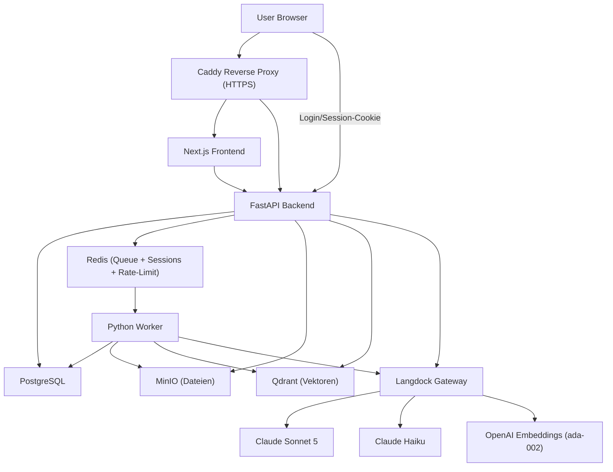

# NotebookLM Clone (self-hosted, Langdock-basiert)

Ein selbst-gehosteter NotebookLM-Klon: Notebooks anlegen, Quellen hochladen,
automatisch parsen/chunken/embedden und mit einem quellengebundenen Chat
inklusive Zitaten befragen. Alle KI-Funktionen laufen ausschließlich über
[Langdock](https://langdock.com) (Claude Sonnet 5, Claude Haiku, OpenAI-
kompatible Embeddings) - es gibt keine direkten Aufrufe an OpenAI, Anthropic
oder andere Modell-Provider.

Weiterführende Dokumentation:

- [`docs/architecture.md`](docs/architecture.md) - Zielarchitektur, Komponenten, Datenmodell
- [`docs/rag-pipeline.md`](docs/rag-pipeline.md) - RAG-Flow im Detail (Retrieval, Context Assembly, Citation Validation)
- [`docs/langdock.md`](docs/langdock.md) - Langdock-Integration, Modell-IDs, Rate Limits
- [`docs/deployment.md`](docs/deployment.md) - Deployment mit Docker Compose + Caddy
- [`docs/security.md`](docs/security.md) - Auth, Zugriffskontrolle, Datenschutz

## Architektur auf einen Blick



> **Caddy-Deployment:** Im Standardfall startet das Projekt einen eigenen `caddy`-Container. Auf Hosts, auf denen Port 80/443 bereits von einem anderen Caddy-Container belegt ist, kann der eigene Service durch einen geteilten Caddy ersetzt werden – siehe [`docs/deployment.md`](docs/deployment.md), Abschnitt „Deployment mit geteiltem Caddy".

## Voraussetzungen

- Docker & Docker Compose (v2)
- Ein gültiger [Langdock](https://langdock.com) API-Key mit Zugriff auf
  Claude Sonnet 5, Claude Haiku und die OpenAI-kompatiblen Embeddings
- `make` (optional, aber empfohlen - alle Befehle funktionieren auch direkt mit `docker compose`)

## Schnellstart

```bash
# 1. .env aus Vorlage erzeugen
make env
# oder: cp .env.example .env

# 2. .env bearbeiten und mindestens folgende Werte setzen:
#    LANGDOCK_API_KEY=...
#    LANGDOCK_PRIMARY_MODEL=...   (Claude Sonnet 5 Modell-ID, siehe docs/langdock.md)
#    LANGDOCK_FAST_MODEL=...      (Claude Haiku Modell-ID, siehe docs/langdock.md)

# 3. Gesamten Stack bauen und starten
make up
# oder: docker compose up -d --build

# 4. Datenbank-Schema anlegen
make migrate
# oder: docker compose exec api alembic upgrade head

# 5. (optional) Demo-User und Demo-Notebook seeden
make seed
```

Danach ist die Anwendung erreichbar unter:

- Frontend direkt: http://localhost:3000
- API direkt: http://localhost:8000 (Swagger-UI unter `/docs`)
- Über Caddy (eine Domain, lokal ohne echtes TLS-Zertifikat): http://localhost
- MinIO-Konsole: http://localhost:9001
- Qdrant-Dashboard: http://localhost:6333/dashboard

`make seed` legt den Demo-User `DEV_DEMO_USER_EMAIL` mit dem Passwort aus
`DEV_DEMO_USER_PASSWORD` (`.env`) an. Anmelden über den echten Login-Screen
unter `/login` mit diesen Zugangsdaten - siehe
[`docs/security.md`](docs/security.md).

## Nützliche Befehle

```bash
make logs            # Logs aller Services
make api-logs        # Nur API-Logs
make worker-logs      # Nur Worker-Logs
make api-shell        # Shell im API-Container
make db-shell         # psql-Shell auf Postgres
make migrate-autogenerate msg="add xyz"   # neue Alembic-Migration erzeugen
make qdrant-setup     # Qdrant-Collection idempotent (neu) anlegen
make down             # Stack stoppen
make clean            # Stack stoppen und Volumes löschen (DESTRUKTIV)
```

## Projektstruktur

```text
NotebookLMC/
├── apps/
│   ├── frontend/   Next.js 15 (App Router), TypeScript, Tailwind CSS
│   ├── api/        FastAPI, SQLAlchemy (async), Alembic
│   └── worker/      Python RQ-Worker (Parsing, Chunking, Embeddings, Qdrant-Indexierung)
├── packages/
│   ├── prompts/         Prompt-Templates (system_final_answer, Haiku-Prompts, Output-Schema)
│   ├── shared-types/    Referenz-TypeScript-Interfaces für die API-Contracts
│   └── evals/            Golden-Dataset + Eval-Skript-Platzhalter
├── infra/
│   ├── caddy/Caddyfile
│   ├── backup/           Backup-Skripte (Postgres, MinIO, Qdrant)
│   └── scripts/
├── docs/
├── docker-compose.yml
├── .env.example
└── Makefile
```

## Feature-Umfang

### Kernflow

1. Notebook anlegen, Login/Registrierung über `/login` und `/register`
2. Quelle hochladen (PDF, DOCX, TXT, Markdown, HTML, CSV, XLSX)
3. Datei landet in MinIO, `sources`-Eintrag in Postgres, Job wird über Redis/RQ eingereiht
4. Worker: Text extrahieren → Chunking → Embeddings über Langdock → Vektoren in Qdrant
5. Chatfrage stellen → Query-Embedding → Qdrant-Suche → Context Assembly → Sonnet-5-Antwort → Citation Validation
6. Antwort mit Quellenkarten im Frontend

### Studio (7 Artefakt-Typen, vollständig implementiert)

Alle Studio-Typen generieren ihren Artefakt aus dem gesamten Notebook-Kontext über Sonnet 5 (Anthropic Tool-Use) und bieten Word- und PDF-Export; Mindmap zusätzlich PNG-Export (SVG → cairosvg):

- **Zusammenfassung** – Markdown-formatierte Gesamtzusammenfassung aller Quellen
- **FAQ** – strukturierte Frage-Antwort-Paare mit Quellenreferenzen
- **Timeline** – chronologisch sortierte Ereignisliste
- **Briefing** – Kernpunkte, Risiken, empfohlene Maßnahmen, offene Fragen
- **Quiz** – Multiple-Choice-Fragen zur Wissensüberprüfung
- **Mindmap** – interaktiver React-Flow-Graph mit radialem Layout + PNG-Export
- **Infografik** – Poster-Layout mit Headline, Statistiken und Abschnittskarten

### Notizen

Vollständiges CRUD für Notebook-Notizen (`apps/api/app/notes/router.py`, `apps/frontend/components/notes/NotesPanel.tsx`).

### Offene Lücken (bewusst, für Produktivbetrieb relevant)

- Kein Passwort-Reset-Flow, keine E-Mail-Verifizierung
- Rate-Limiting gilt für `/api/auth/login`, aber **nicht** für `/api/auth/register`
- Notebook-Sharing über `notebook_members` ist im Datenmodell vorbereitet, aber nicht aktiv genutzt
- Audio/Podcast-Feature aus der ursprünglichen Spezifikation wurde bewusst nicht umgesetzt

Architektur-Details: [`docs/architecture.md`](docs/architecture.md)

