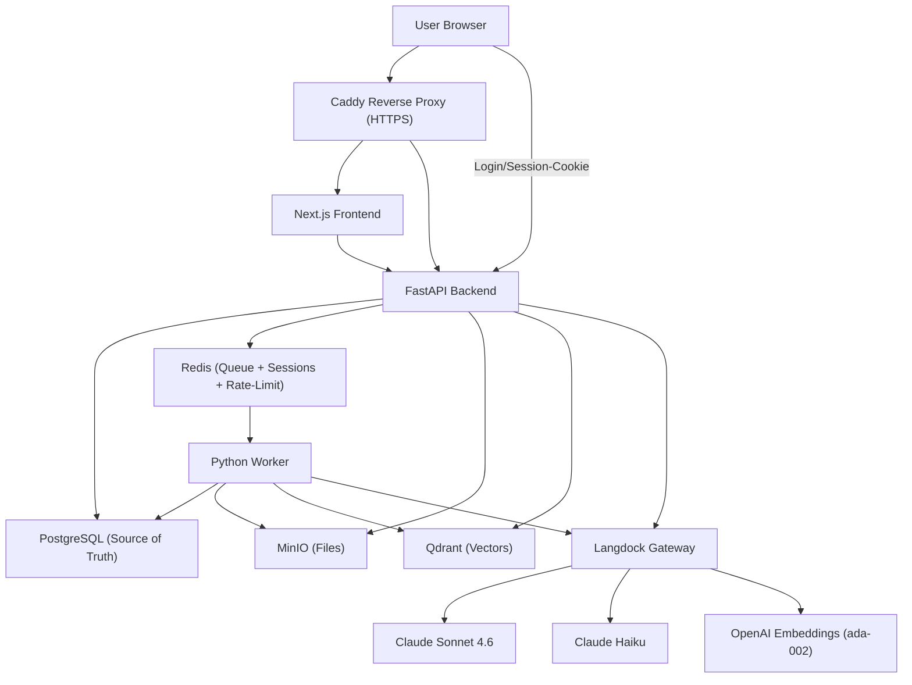

# NotebookLMC

[](https://github.com/Hereliesviolet/notebooklmc/actions/workflows/pytest.yml)

A self-hosted NotebookLM-style workspace: upload documents into notebooks, chat with them, and generate summaries, FAQs, quizzes and mind maps, with citations that are validated against your own database before they are shown.

> **TODO:** screenshot / GIF of the notebook view. Not added yet.

## Features

- Notebooks with source upload for PDF, DOCX, TXT, Markdown, HTML, CSV and XLSX (50 MB per file by default).
- Background processing in a worker: parsing, section-based chunking, embeddings, indexing into Qdrant. Job status is tracked in Postgres. Scanned PDFs without a text layer fall back to vision-model OCR.
- Chat restricted to the notebook's sources. The model has to cite chunks; the API drops citations that do not exist in the notebook and lowers the confidence to `low` when none survive. Retrieval guarantees that a large source does not crowd out the others.
- Studio: summary, FAQ, timeline, briefing, quiz, mind map and infographic, generated from the notebook's indexed sources and exportable to Word and PDF (mind map also to PNG).
- Notes per notebook.
- Login with Argon2 password hashes, server-side sessions in Redis, CSRF protection and rate limits on login and registration.
- All model calls go through [Langdock](https://langdock.com); no code path talks to a model provider directly.
- The UI, prompts and error messages are in German.

## Tech stack

| Layer | Technology |
| --- | --- |
| Frontend | Next.js 15 (App Router), React 19, TypeScript, Tailwind CSS |
| API | FastAPI, SQLAlchemy 2 (async), Alembic, Pydantic 2, Gunicorn/Uvicorn |
| Worker | Python, RQ, pypdf, python-docx, pandas, BeautifulSoup |
| Data | PostgreSQL 16, Qdrant, MinIO, Redis 7 |
| Models | Claude Sonnet and Haiku, OpenAI `text-embedding-ada-002`, all via Langdock |
| Ops | Docker Compose, Caddy, GitHub Actions |

## Architecture



Uploads are stored in MinIO, a row goes into Postgres and a job into the Redis queue. The worker parses and chunks the file, embeds the chunks through Langdock and writes the vectors to Qdrant. A chat question is embedded, searched in Qdrant (always filtered by notebook), assembled into a context from the chunk texts in Postgres, answered by Sonnet through a forced tool call, and the citations are validated before the response is returned.

More detail in [`docs/`](docs):

- [architecture.md](docs/architecture.md): components, API routes, data model, current limitations
- [rag-pipeline.md](docs/rag-pipeline.md): retrieval, context assembly, citation validation
- [langdock.md](docs/langdock.md): gateway usage, model ids, retries, prompt caching
- [security.md](docs/security.md): auth, CSRF, network exposure, known gaps
- [deployment.md](docs/deployment.md): Compose, Caddy, sharing an existing Caddy, backups

## Quick start

Requirements: Docker with Compose v2, and a Langdock API key with access to a Claude Sonnet model, a Claude Haiku model and the OpenAI-compatible embeddings.

```bash
cp .env.example .env
# edit .env and set at least:
#   LANGDOCK_API_KEY
#   LANGDOCK_PRIMARY_MODEL   (Sonnet model id of your workspace, see docs/langdock.md)
#   LANGDOCK_FAST_MODEL      (Haiku model id of your workspace)

docker compose up -d --build
docker compose exec api alembic upgrade head
docker compose exec api python -m app.scripts.seed_demo   # optional demo user
```

`make up`, `make migrate` and `make seed` are shortcuts for the same commands; `make help` lists the others.

Then open:

- http://localhost (through Caddy) or http://localhost:3000 (frontend directly)
- http://localhost:8000/docs for the API documentation
- http://localhost:9001 for the MinIO console, http://localhost:6333/dashboard for Qdrant

Log in with `DEV_DEMO_USER_EMAIL` and `DEV_DEMO_USER_PASSWORD` from `.env` if you ran the seed step, or register a new user at `/register`.

### Running the tests

Run these in a virtual environment.

```bash
# worker (no services needed)
cd apps/worker && pip install -r requirements.txt
LANGDOCK_PRIMARY_MODEL=x LANGDOCK_FAST_MODEL=y pytest

# api (needs Postgres and Redis, defaults match .env.example with host localhost)
cd apps/api && pip install -r requirements.txt
export POSTGRES_HOST=localhost REDIS_URL=redis://localhost:6379/0 LANGDOCK_PRIMARY_MODEL=x LANGDOCK_FAST_MODEL=y
alembic upgrade head && pytest

# lint and format
ruff check apps && ruff format --check apps
cd apps/frontend && npm ci && npm run typecheck && npm run lint && npm run format:check && npm run build
```

The tests do not call Langdock, so no key is needed; the API tests use a real Postgres and Redis. Studio export needs the pango and cairo system libraries (see `apps/api/Dockerfile`).

## Configuration

Configuration is read from environment variables; `.env.example` has all of them with comments. The ones that matter most:

| Variable | Default | Purpose |
| --- | --- | --- |
| `LANGDOCK_API_KEY` | empty | Langdock API key |
| `LANGDOCK_PRIMARY_MODEL` | `claude-sonnet-4-6-default` | Model id for answers and studio artifacts. Workspace specific. |
| `LANGDOCK_FAST_MODEL` | `claude-haiku-4-5@20251001` | Model id for intent detection and query rewrite. Workspace specific. |
| `LANGDOCK_ANTHROPIC_BASE_URL` | `https://api.langdock.com/anthropic/eu/v1` | Anthropic-compatible endpoint |
| `EMBEDDING_BASE_URL` | `https://api.langdock.com/openai/eu/v1` | OpenAI-compatible embedding endpoint |
| `EMBEDDING_MODEL` | `text-embedding-ada-002` | Embedding model |
| `QDRANT_VECTOR_SIZE` | `1536` | Vector size, must match the embedding model |
| `LANGDOCK_RETRY_BACKOFF_SECONDS` | `5,15,30,60` | Waits between retries after an HTTP 429 |
| `PDF_OCR_FALLBACK_ENABLED` | `true` | OCR scanned PDFs through the vision model |
| `ENABLE_INTENT_DETECTION` | `false` | Optional Haiku intent detection before retrieval |
| `ENABLE_QUERY_REWRITE` | `false` | Optional Haiku query rewrite before retrieval |
| `CONTEXT_MAX_CHUNKS_PER_SOURCE` | `4` | Per-source cap when filling the context |
| `CHAT_ANSWER_MAX_TOKENS` | `4096` | Token budget of a chat answer, retried once with double on truncation |
| `MAX_UPLOAD_SIZE_MB` | `50` | Upload size limit |
| `MIN_PASSWORD_LENGTH` | `10` | Minimum password length |
| `SESSION_TTL_SECONDS` | `604800` | Sliding session lifetime (7 days) |
| `SESSION_COOKIE_SECURE` | `false` | Must be `true` behind HTTPS, `false` on plain HTTP |
| `SESSION_COOKIE_DOMAIN` | empty | Empty keeps the cookie host-only |
| `DEV_DEMO_USER_EMAIL` / `_NAME` / `_PASSWORD` | `demo@notebooklmc.dev` / `Demo User` / `change-me-in-local-env` | Demo user created by the seed script |
| `APP_ENV` | `development` | Environment name |
| `APP_URL` | `http://localhost:3000` | Allowed CORS origin, only relevant for cross-origin API access |
| `NEXT_PUBLIC_API_URL` | empty | Absolute API URL for a separate API domain. Build-time, rebuild the frontend after changing. |
| `INTERNAL_API_URL` | `http://api:8000` | Where the Next.js server forwards `/api/*` |
| `BIND_ADDRESS` | `127.0.0.1` | Host address for published ports. Do not set `0.0.0.0` on a public host. |
| `POSTGRES_*`, `REDIS_URL`, `QDRANT_*`, `MINIO_*` | see file | Connection settings of the backing services |

Change `POSTGRES_PASSWORD`, `MINIO_ROOT_PASSWORD` and `DEV_DEMO_USER_PASSWORD` before exposing an instance. Some variables in `.env.example` (Langdock Agents/Knowledge/Usage Export, reranker, worker concurrency) are marked as reserved: they are defined but nothing reads them yet.

## Roadmap

Not implemented:

- Password reset and e-mail verification.
- Sharing a notebook between users (access is owner-only).
- Reranking of retrieved chunks; retrieval uses a score heuristic.
- Streaming chat responses.
- A separate queue and concurrency limit for embedding jobs.
- A download endpoint for the original files.
- An evaluation harness for retrieval and answer quality.

## License

MIT, see [LICENSE](LICENSE).
