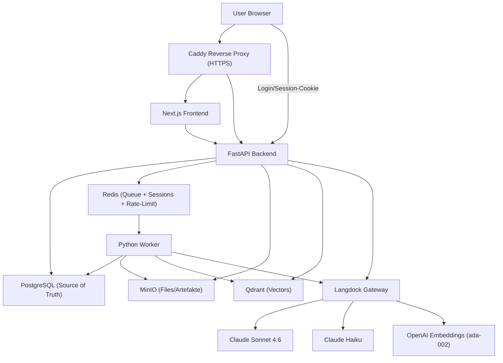

# Architektur

## 1. Zielarchitektur



> **Caddy-Deployment:** Im Standardfall startet das Projekt einen eigenen `caddy`-Container. Auf Hosts, auf denen Port 80/443 bereits von einem anderen Caddy-Container belegt ist, kann der eigene Service durch einen geteilten Caddy ersetzt werden – siehe [`docs/deployment.md`](deployment.md), Abschnitt „Deployment mit geteiltem Caddy".

Kein Service in diesem Projekt spricht direkt mit OpenAI, Anthropic oder
einem anderen Modell-Provider. Jeder KI-Aufruf läuft ausschließlich über
Langdock (Details: [`docs/langdock.md`](langdock.md)).

## 2. Komponenten

| Komponente | Technologie | Verantwortung |
| --- | --- | --- |
| Frontend | Next.js 15 (App Router), TypeScript, Tailwind CSS | Notebook-Übersicht/-Detail, Upload-UI, Chat-UI mit Quellenkarten, Studio (7 Artefakt-Typen: Zusammenfassung, FAQ, Timeline, Briefing, Quiz, Mindmap, Infografik), Notizen, Login/Registrierung |
| API | FastAPI, SQLAlchemy (async, asyncpg), Alembic | REST-API, Auth, RAG-Orchestrierung, Citation Validation, Langdock-Client |
| Worker | Python, RQ (Redis-Queue) | Parsing, Chunking, Embeddings, Qdrant-Indexierung, Jobstatus |
| PostgreSQL | - | Relationale Source of Truth (Notebooks, Sources, Chunks, Messages, Jobs, ...) |
| Qdrant | - | Vektor-Suche über Chunk-Embeddings |
| MinIO | - | Objektspeicher für Originaldateien und extrahierte Artefakte |
| Redis | - | Job-Queue (RQ) für den Worker |
| Caddy | - | Reverse Proxy, HTTPS-Terminierung |

## 3. Ordnerstruktur

```text
NotebookLMC/
├── apps/
│   ├── frontend/
│   ├── api/
│   └── worker/
├── packages/
│   ├── prompts/
│   ├── shared-types/
│   └── evals/
├── infra/
│   ├── caddy/
│   ├── backup/
│   └── scripts/
├── docs/
├── docker-compose.yml
├── .env.example
├── README.md
└── Makefile
```

## 4. Backend-Architektur (FastAPI)

```text
apps/api/app/
├── main.py                 FastAPI App, Router-Registrierung, CORS, Startup (Qdrant/MinIO ensure)
├── core/                    config.py, security.py (Argon2-Hashing, get_current_user),
│                            sessions.py (Redis-Sessions, Sliding-TTL), rate_limit.py
│                            (Fixed-Window-Limiter für /api/auth/login),
│                            middleware.py (CsrfMiddleware), logging.py, deps.py
├── db/                      base.py, session.py, models.py (10 Tabellen)
├── schemas/                 Pydantic-Schemas je Domäne
├── auth/, notebooks/, sources/, notes/, chat/, studio/   Router + Service je Domäne
├── rag/                     retrieval.py, context_assembly.py, citation_validation.py, query_understanding.py
├── langdock/                 client.py, model_router.py, prompts_loader.py
├── qdrant/                   client.py (Collection-Setup, Search)
├── storage/                  minio_client.py
├── jobs/                     queue.py (RQ enqueue-Helper)
└── alembic/                  Migrationen
```

**Auth:** Echte E-Mail/Passwort-Anmeldung mit Argon2-Passwort-Hashing und
serverseitigen Redis-Sessions (`httpOnly`-Cookie `session_id` + CSRF-Cookie
`csrf_token`, Double-Submit-Cookie-Schutz via `CsrfMiddleware`). Kein Token
im Response-Body mehr. `get_current_user` validiert ausschließlich die
Session aus dem Cookie - Details siehe [`docs/security.md`](security.md).

## 5. Frontend-Architektur (Next.js)

```text
apps/frontend/
├── app/                 layout.tsx, page.tsx (Notebook-Übersicht),
│                        notebooks/[id]/page.tsx (3-Spalten-Detail),
│                        login/, register/,
│                        api/[...path]/route.ts (Next.js-Route-Handler-Proxy zu api:8000)
├── components/
│   ├── notebooks/       NotebookCard, CreateNotebookDialog
│   ├── sources/         SourceList, SourceCard, UploadDropzone, SourceStatusBadge
│   ├── chat/            ChatPanel, MessageBubble, CitationCard, FollowUpChips
│   ├── studio/          StudioPanel, StudioFullscreenOverlay,
│   │                    StudioFaqView, StudioTimelineView, StudioBriefingView,
│   │                    StudioQuizView, StudioMindmapView, StudioInfographicView
│   │                    (je Typ Export-Buttons für Word/PDF, Mindmap zusätzlich PNG)
│   ├── notes/           NotesPanel
│   ├── layout/          Sidebar (inkl. Logout), AuthGate (Session-Check + Redirect zu /login)
│   └── ui/              Button, Card, Badge, Input, Textarea, Dialog (shadcn/ui-inspiriert)
└── lib/                 api-client.ts, types.ts (Mirror von packages/shared-types)
```

Die Notebook-Detailseite ist ein 3-Spalten-Layout: Quellen/Notizen (links),
Chat (Mitte), Studio (rechts) - analog zum NotebookLM-Original.

## 6. Worker-Architektur

```text
apps/worker/app/
├── main.py                RQ-Entrypoint, Queues: embeddings, default
├── jobs/process_source.py  Hauptjob: Parsing -> Chunking -> Embedding -> Qdrant -> Status-Update
├── parsing/                pdf.py, docx.py, txt_md.py, html.py, csv_xlsx.py, registry.py
├── chunking/chunker.py      Heading/Absatz-basiertes Chunking mit Sliding-Window für lange Abschnitte
├── embeddings/langdock_embeddings.py   Batch-Embedding über Langdock
├── indexing/qdrant_indexer.py           Vektor-Upsert mit Payload
├── langdock/                 client.py, model_router.py, prompts_loader.py (gespiegelt von api)
└── db/models.py               Gespiegelte SQLAlchemy-Modelle (ohne FKs, siehe unten)
```

**Hinweis Code-Sharing:** `LangdockClient`, Qdrant-/MinIO-Clients und die
SQLAlchemy-Modelle sind zwischen `api` und `worker` bewusst dupliziert
(leichtgewichtig, je ~100-200 Zeilen) statt über ein gemeinsames
Python-Package geteilt, da die vorgegebene `packages/`-Struktur kein
Python-Shared-Lib vorsieht und beide Services unabhängig deploybar bleiben
sollen. Die Worker-Modelle deklarieren bewusst **keine** `ForeignKey`s auf
`notebooks`/`users` (die im Worker-Metadata nicht existieren) - referenzielle
Integrität wird ausschließlich über die vom `api`-Service verwalteten
Alembic-Migrationen in Postgres sichergestellt.

## 7. Datenbankmodell

10 Tabellen, UUID-Primärschlüssel: `users`, `notebooks`, `notebook_members`,
`sources`, `chunks`, `messages`, `notes`, `jobs`, `audit_events`,
`langdock_requests`. Migrationen liegen unter `apps/api/alembic/versions/`,
Ausführung ausschließlich über den `api`-Service (`make migrate`).

## 8. Qdrant Collection Design

- Collection: `notebook_chunks`
- Vector Size: `1536` (text-embedding-ada-002)
- Distance: Cosine
- Payload: `notebook_id`, `source_id`, `chunk_id`, `document_name`,
  `page_start`, `page_end`, `heading`, `chunk_type`, `created_at`
- Payload-Indizes auf `notebook_id` und `source_id` für schnelle gefilterte Suche
- Collection-Erstellung ist idempotent und läuft beim Start von `api` und `worker`

## 9. MinIO Storage-Konzept

Bucket `notebook-files`, Pfadschema:

```text
notebook-files/
├── {notebook_id}/{source_id}/original/{filename}
└── {notebook_id}/{source_id}/extracted/text.txt   (für spätere Erweiterungen vorgesehen)
```

Kein öffentlicher Bucket-Zugriff; Downloads laufen über signierte URLs
(`get_presigned_download_url`).

## 10. Redis Queue-Konzept

Zwei RQ-Queues: `default` (Parsing/Chunking/Indexierung) und `embeddings`
(separat für Langdock-Embedding-Calls, damit deren Concurrency unabhängig
steuerbar ist, siehe `WORKER_EMBEDDING_CONCURRENCY`). Jobstatus wird
zusätzlich in der Postgres-Tabelle `jobs` persistiert - Redis ist nur die
Queue-Mechanik, nicht die Status-Wahrheit.

## 11. Implementierungsstand und Roadmap

**Vollständig implementiert:**

- **Kernflow:** Notebook → Upload → Parsing → Chunking → Embedding → Qdrant-Indexierung → Chat mit Citation Validation
- **Auth:** E-Mail/Passwort-Registrierung und Login (`/api/auth/register`, `/api/auth/login`, `/api/auth/logout`, `/api/auth/me`), serverseitige Redis-Sessions (httpOnly-Cookie `session_id`), CSRF-Double-Submit-Cookie-Schutz (`CsrfMiddleware`), Rate-Limiting auf Login (Redis-Fixed-Window, 5/min/IP+E-Mail)
- **Studio (7 Artefakt-Typen):** Zusammenfassung, FAQ, Timeline, Briefing, Quiz, Mindmap, Infografik – jeweils mit Word- und PDF-Export; Mindmap zusätzlich mit PNG-Export (SVG → cairosvg). Audio/Podcast-Script bleibt bewusst `501 Not Implemented` (Scope-Entscheidung, siehe ursprüngliche Spec in `notebooklm clone.md`)
- **Notizen:** Vollständiges CRUD (`apps/api/app/notes/router.py`, `apps/frontend/components/notes/NotesPanel.tsx`)

**Offene Punkte (Roadmap):**

- Kein Passwort-Reset-Flow (E-Mail-Versand nicht implementiert); vergessene Passwörter erfordern aktuell einen manuellen DB-Eingriff
- Keine E-Mail-Verifizierung bei der Registrierung
- Rate-Limiting auf `/api/auth/login` ist implementiert, **nicht** aber auf `/api/auth/register` (bekannte, offene Lücke)
- `notebook_members`-basiertes Sharing ist im Datenmodell vorhanden, aber `assert_can_access()` prüft ausschließlich Besitzerschaft (`owner_id`) – kein Multi-User-Sharing aktiv
- Haiku-Reranking (`RERANKER_ENABLED`) ist konfigurierbar vorbereitet, aber nicht aktiv genutzt
- Streaming-Antworten (`LangdockClient.stream()`) sind vorbereitet, aber nicht im Chat-Endpoint aktiv
- Docling/Unstructured-basiertes Parsing für gescannte PDFs (aktuell: Vision-OCR-Fallback im Worker)

## 12. Risiken und offene Punkte

- **Langdock-Modell-IDs:** `LANGDOCK_PRIMARY_MODEL`/`LANGDOCK_FAST_MODEL` sind
  in `.env.example` mit Beispiel-/Default-Werten aus einem konkreten
  Langdock-Workspace vorbelegt, sind aber workspace-/regionsabhängig – siehe
  [`docs/langdock.md`](langdock.md) zur Ermittlung der für den eigenen
  Workspace gültigen IDs. Der Code liest diese IDs ausschließlich aus der
  Konfiguration, niemals hartkodiert.
- **Parsing-Qualität:** Bewusst schlanke Libraries (`pypdf`, `python-docx`,
  `pandas`, `beautifulsoup4`) statt Docling/Unstructured, um Docker-Images
  klein zu halten. Gescannte PDFs ohne Text-Layer werden über einen
  Vision-OCR-Fallback verarbeitet (im Worker-Log als
  `falling back to Vision OCR` sichtbar).
- **Kein TLS im lokalen Setup:** Caddy läuft lokal ohne echte
  Domain/Zertifikat. Für Produktion (echte Domain, TLS) siehe
  [`docs/deployment.md`](deployment.md); für Auth-Sicherheitsdetails
  [`docs/security.md`](security.md).
- **Frontend-Abhängigkeiten:** Next.js `15.5.20`, React `19.2.7`. `npm audit`
  meldet 0 vulnerabilities (nach dem Next.js 14→15 + React 18→19
  Major-Upgrade, Juli 2026 – Details in [`docs/dependabot-notes.md`](dependabot-notes.md)).
- **Rate-Limiting:** Gilt für `/api/auth/login` (Redis-Fixed-Window,
  5/min/IP+E-Mail), **nicht** für `/api/auth/register` – bekannte, offene
  Lücke, die bei öffentlichem Betrieb zu schließen ist.
- **Bekannte fehlende Auth-Features:** Kein Passwort-Reset-Flow, keine
  E-Mail-Verifizierung, kein Notebook-Sharing (nur Besitzerschaft geprüft) –
  Details in [`docs/security.md`](security.md).
