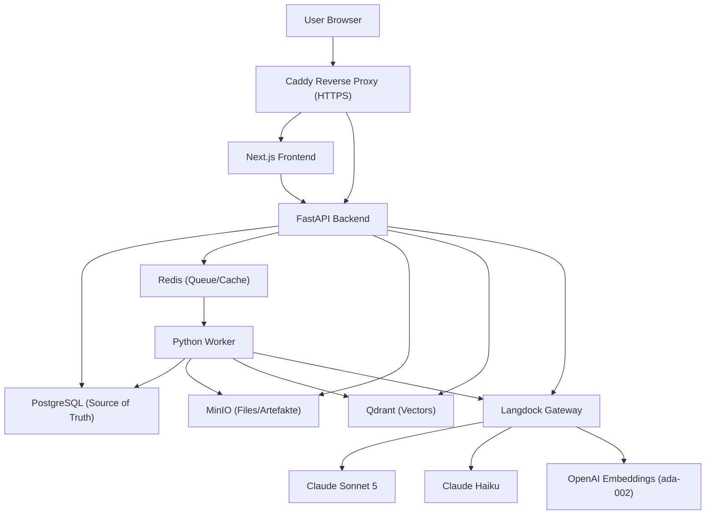

# Architektur

## 1. Zielarchitektur



Kein Service in diesem Projekt spricht direkt mit OpenAI, Anthropic oder
einem anderen Modell-Provider. Jeder KI-Aufruf läuft ausschließlich über
Langdock (Details: [`docs/langdock.md`](langdock.md)).

## 2. Komponenten

| Komponente | Technologie | Verantwortung |
| --- | --- | --- |
| Frontend | Next.js 14 (App Router), TypeScript, Tailwind CSS | Notebook-Übersicht/-Detail, Upload-UI, Chat-UI mit Quellenkarten, Studio-Platzhalter, Notizen |
| API | FastAPI, SQLAlchemy (async, asyncpg), Alembic | REST-API, Auth, RAG-Orchestrierung, Citation Validation, Langdock-Client |
| Worker | Python, RQ (Redis-Queue) | Parsing, Chunking, Embeddings, Qdrant-Indexierung, Jobstatus |
| PostgreSQL | - | Relationale Source of Truth (Notebooks, Sources, Chunks, Messages, Jobs, ...) |
| Qdrant | - | Vektor-Suche über Chunk-Embeddings |
| MinIO | - | Objektspeicher für Originaldateien und extrahierte Artefakte |
| Redis | - | Job-Queue (RQ) für den Worker |
| Caddy | - | Reverse Proxy, HTTPS-Terminierung |

## 3. Ordnerstruktur

```text
NotebookLMC/
├── apps/
│   ├── frontend/
│   ├── api/
│   └── worker/
├── packages/
│   ├── prompts/
│   ├── shared-types/
│   └── evals/
├── infra/
│   ├── caddy/
│   ├── backup/
│   └── scripts/
├── docs/
├── docker-compose.yml
├── .env.example
├── README.md
└── Makefile
```

## 4. Backend-Architektur (FastAPI)

```text
apps/api/app/
├── main.py                 FastAPI App, Router-Registrierung, CORS, Startup (Qdrant/MinIO ensure)
├── core/                    config.py, security.py (Dev-Auth), logging.py, deps.py
├── db/                      base.py, session.py, models.py (10 Tabellen)
├── schemas/                 Pydantic-Schemas je Domäne
├── auth/, notebooks/, sources/, notes/, chat/, studio/   Router + Service je Domäne
├── rag/                     retrieval.py, context_assembly.py, citation_validation.py, query_understanding.py
├── langdock/                 client.py, model_router.py, prompts_loader.py
├── qdrant/                   client.py (Collection-Setup, Search)
├── storage/                  minio_client.py
├── jobs/                     queue.py (RQ enqueue-Helper)
└── alembic/                  Migrationen
```

**Auth (MVP):** Ein Demo-User wird beim ersten Login automatisch angelegt.
`POST /api/auth/login` gibt ein statisches, opakes Bearer-Token zurück
(`dev:<user_id>`). `get_current_user` ist die einzige Stelle, die für echte
Auth (SSO/Entra ID) ausgetauscht werden muss - siehe
[`docs/security.md`](security.md).

## 5. Frontend-Architektur (Next.js)

```text
apps/frontend/
├── app/                 layout.tsx, page.tsx (Notebook-Übersicht), notebooks/[id]/page.tsx (3-Spalten-Detail)
├── components/
│   ├── notebooks/       NotebookCard, CreateNotebookDialog
│   ├── sources/         SourceList, SourceCard, UploadDropzone, SourceStatusBadge
│   ├── chat/            ChatPanel, MessageBubble, CitationCard, FollowUpChips
│   ├── studio/          StudioPanel (MVP2-Platzhalter)
│   ├── notes/           NotesPanel
│   ├── layout/          Sidebar, AuthGate (Dev-Auto-Login)
│   └── ui/              Button, Card, Badge, Input, Textarea, Dialog (shadcn/ui-inspiriert)
└── lib/                 api-client.ts, types.ts (Mirror von packages/shared-types)
```

Die Notebook-Detailseite ist ein 3-Spalten-Layout: Quellen/Notizen (links),
Chat (Mitte), Studio (rechts) - analog zum NotebookLM-Original.

## 6. Worker-Architektur

```text
apps/worker/app/
├── main.py                RQ-Entrypoint, Queues: embeddings, default
├── jobs/process_source.py  Hauptjob: Parsing -> Chunking -> Embedding -> Qdrant -> Status-Update
├── parsing/                pdf.py, docx.py, txt_md.py, html.py, csv_xlsx.py, registry.py
├── chunking/chunker.py      Heading/Absatz-basiertes Chunking mit Sliding-Window für lange Abschnitte
├── embeddings/langdock_embeddings.py   Batch-Embedding über Langdock
├── indexing/qdrant_indexer.py           Vektor-Upsert mit Payload
├── langdock/                 client.py, model_router.py, prompts_loader.py (gespiegelt von api)
└── db/models.py               Gespiegelte SQLAlchemy-Modelle (ohne FKs, siehe unten)
```

**Hinweis Code-Sharing:** `LangdockClient`, Qdrant-/MinIO-Clients und die
SQLAlchemy-Modelle sind zwischen `api` und `worker` bewusst dupliziert
(leichtgewichtig, je ~100-200 Zeilen) statt über ein gemeinsames
Python-Package geteilt, da die vorgegebene `packages/`-Struktur kein
Python-Shared-Lib vorsieht und beide Services unabhängig deploybar bleiben
sollen. Die Worker-Modelle deklarieren bewusst **keine** `ForeignKey`s auf
`notebooks`/`users` (die im Worker-Metadata nicht existieren) - referenzielle
Integrität wird ausschließlich über die vom `api`-Service verwalteten
Alembic-Migrationen in Postgres sichergestellt.

## 7. Datenbankmodell

10 Tabellen, UUID-Primärschlüssel: `users`, `notebooks`, `notebook_members`,
`sources`, `chunks`, `messages`, `notes`, `jobs`, `audit_events`,
`langdock_requests`. Migrationen liegen unter `apps/api/alembic/versions/`,
Ausführung ausschließlich über den `api`-Service (`make migrate`).

## 8. Qdrant Collection Design

- Collection: `notebook_chunks`
- Vector Size: `1536` (text-embedding-ada-002)
- Distance: Cosine
- Payload: `notebook_id`, `source_id`, `chunk_id`, `document_name`,
  `page_start`, `page_end`, `heading`, `chunk_type`, `created_at`
- Payload-Indizes auf `notebook_id` und `source_id` für schnelle gefilterte Suche
- Collection-Erstellung ist idempotent und läuft beim Start von `api` und `worker`

## 9. MinIO Storage-Konzept

Bucket `notebook-files`, Pfadschema:

```text
notebook-files/
├── {notebook_id}/{source_id}/original/{filename}
└── {notebook_id}/{source_id}/extracted/text.txt   (für spätere Erweiterungen vorgesehen)
```

Kein öffentlicher Bucket-Zugriff; Downloads laufen über signierte URLs
(`get_presigned_download_url`).

## 10. Redis Queue-Konzept

Zwei RQ-Queues: `default` (Parsing/Chunking/Indexierung) und `embeddings`
(separat für Langdock-Embedding-Calls, damit deren Concurrency unabhängig
steuerbar ist, siehe `WORKER_EMBEDDING_CONCURRENCY`). Jobstatus wird
zusätzlich in der Postgres-Tabelle `jobs` persistiert - Redis ist nur die
Queue-Mechanik, nicht die Status-Wahrheit.

## 11. MVP-Umfang und Roadmap

**MVP1 (aktueller Stand):** Notebook → Upload → Parsing → Chunking →
Embedding → Qdrant-Indexierung → Chat mit Citation Validation.

**MVP2 (vorbereitet, nicht implementiert):** Studio-Funktionen
(Zusammenfassung, FAQ, Timeline, Briefing) - Router-Struktur existiert unter
`apps/api/app/studio/router.py`, liefert aktuell `501 Not Implemented`.

**Später denkbar:** Sharing/Rollen über `notebook_members`, echte SSO-Auth,
Docling/Unstructured-basiertes Parsing für komplexe/gescannte Dokumente,
Haiku-Reranking, Streaming-Antworten (Client dafür in `LangdockClient.stream()`
bereits vorbereitet).

## 12. Risiken und offene Punkte

- **Langdock-Modell-IDs:** `LANGDOCK_PRIMARY_MODEL`/`LANGDOCK_FAST_MODEL` sind
  in `.env.example` mit Beispiel-/Default-Werten aus einem konkreten
  Langdock-Workspace vorbelegt, sind aber workspace-/regionsabhängig - siehe
  [`docs/langdock.md`](langdock.md) zur Ermittlung der für den eigenen
  Workspace gültigen IDs. Der Code liest diese IDs ausschließlich aus der
  Konfiguration, niemals hartkodiert.
- **Parsing-Qualität:** Für die MVP wurden bewusst schlanke Libraries
  (`pypdf`, `python-docx`, `pandas`, `beautifulsoup4`) statt
  Docling/Unstructured gewählt, um Docker-Images klein zu halten. Gescannte
  PDFs ohne Text-Layer werden aktuell nicht per OCR verarbeitet.
  Dieselbe Wahl wurde für den Worker-Container getroffen.
- **Kein produktionsreifes Auth/TLS im lokalen Setup:** Caddy läuft lokal
  ohne echte Domain/Zertifikat; Dev-Auth ist ein Platzhalter (siehe
  [`docs/security.md`](security.md)).
- **Frontend-Abhängigkeiten:** Next.js ist auf `14.2.35` gepinnt (Fix für die
  RSC-DoS-Sicherheitslücken vom Dezember 2025, CVE-2025-55184/67779). Einige
  in `npm audit` verbleibende Advisories (Image-Optimizer, Middleware,
  i18n-Rewrites) betreffen Next.js-Features, die dieses Projekt nicht nutzt,
  und sind erst mit einem Major-Upgrade auf Next.js 16 vollständig behebbar -
  das ist als bekannter, bewusst zurückgestellter Punkt zu behandeln.
