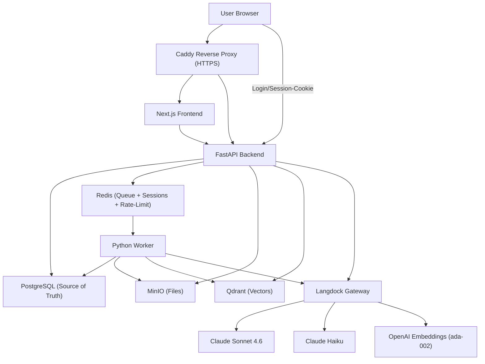

# Architecture

## Overview



No service talks to OpenAI, Anthropic or any other model provider directly.
Every model call goes through Langdock, see [langdock.md](langdock.md).

With the default Compose file the project starts its own `caddy` container. On
a host where ports 80/443 are already taken by another Caddy, the shared-Caddy
overlay replaces it, see [deployment.md](deployment.md).

## Components

| Component | Technology | Responsibility |
| --- | --- | --- |
| Frontend | Next.js 15 (App Router), React 19, TypeScript, Tailwind CSS | Notebook list and detail page, upload, chat with citation cards, studio (seven artifact types), notes, login and registration |
| API | FastAPI, SQLAlchemy 2 (async, asyncpg), Alembic | REST API, auth, RAG orchestration, citation validation, Langdock client, studio generation and export |
| Worker | Python, RQ | Parsing, chunking, embeddings, Qdrant indexing, job status |
| PostgreSQL | - | Relational source of truth (users, notebooks, sources, chunks, messages, ...) |
| Qdrant | - | Vector search over chunk embeddings |
| MinIO | - | Object storage for the uploaded original files |
| Redis | - | RQ job queue, server-side sessions, rate-limit counters |
| Caddy | - | Reverse proxy, TLS termination |

## API

All routes live under `/api`. Apart from `/api/health`, `/api/auth/register`,
`/api/auth/login` and `/api/auth/logout`, a route requires a valid session
cookie, and every notebook operation checks that the caller owns the notebook.

| Area | Routes |
| --- | --- |
| Health | `GET /api/health` |
| Auth | `POST /api/auth/register`, `POST /api/auth/login`, `POST /api/auth/logout`, `GET /api/auth/me` |
| Notebooks | `GET/POST /api/notebooks`, `GET/PATCH/DELETE /api/notebooks/{id}` |
| Sources | `GET /api/notebooks/{id}/sources`, `POST /api/notebooks/{id}/sources/upload`, `GET/DELETE /api/sources/{id}`, `POST /api/sources/{id}/reprocess` |
| Chat | `GET /api/notebooks/{id}/messages`, `POST /api/notebooks/{id}/chat` |
| Notes | `GET/POST /api/notebooks/{id}/notes`, `PATCH/DELETE /api/notes/{id}` |
| Studio | `POST /api/notebooks/{id}/studio/{summary,faq,timeline,briefing,quiz,mindmap,infographic}` generates an artifact, `GET /api/notebooks/{id}/studio/{type}` reads the stored one, `GET /api/notebooks/{id}/studio/{type}/export?format=docx\|pdf\|png` exports it (png only for the mindmap). `POST .../studio/audio-script` returns 501. |

The interactive OpenAPI documentation is served at `/docs` on the API port.

## Backend layout

```text
apps/api/app/
├── main.py            FastAPI app, routers, CORS, startup (ensure MinIO bucket and Qdrant collection)
├── core/              config, security (Argon2, get_current_user), sessions (Redis),
│                      rate_limit, middleware (CSRF, Private Network Access), logging, deps
├── db/                base, session, models (10 tables)
├── schemas/           Pydantic schemas per domain
├── auth/ notebooks/ sources/ notes/ chat/ studio/    router and service per domain
├── rag/               retrieval, context_assembly, citation_validation, query_understanding
├── langdock/          client, prompts_loader
├── qdrant/            collection setup, delete by source
├── storage/           MinIO wrapper
├── jobs/              RQ enqueue helper
└── scripts/           seed_demo
apps/api/alembic/      migrations (six revisions)
```

**Auth.** E-mail and password login with Argon2 hashes and server-side Redis
sessions: an `httpOnly` cookie `session_id` plus a readable `csrf_token` cookie
for double-submit CSRF protection. There is no token in the response body.
Details in [security.md](security.md).

## Frontend layout

```text
apps/frontend/
├── app/         layout, notebook list, notebooks/[id] (three-column detail page),
│                login, register, api/[...path]/route.ts (server-side proxy to the API)
├── components/  notebooks, sources, chat, studio (one view per artifact type),
│                notes, layout (Sidebar, AuthGate), ui (small shadcn-style primitives)
└── lib/         api-client.ts, types.ts (hand-maintained mirror of the API schemas)
```

The detail page has three columns: sources and notes on the left, chat in the
middle, studio on the right.

## Worker layout

```text
apps/worker/app/
├── main.py                  RQ entrypoint, listens on the queues "embeddings" and "default"
├── jobs/process_source.py   parse -> chunk -> embed -> index -> status update
├── parsing/                 pdf, docx, txt_md, html, csv_xlsx, registry, sanitize
├── chunking/chunker.py      section-based chunking, sliding window for long text
├── embeddings/              batched embedding calls through Langdock
├── indexing/                Qdrant upsert with payload
├── langdock/                client, prompts_loader (mirrors the API copy)
├── qdrant/  storage/        clients (mirror the API copies)
└── db/                      mirrored SQLAlchemy models
```

**Duplicated code.** `LangdockClient`, the Qdrant and MinIO wrappers and the
SQLAlchemy models exist once in `api` and once in `worker`. This is deliberate:
the copies are small, the two services stay independently deployable, and
there is no shared Python package to version. The cost is that a change has to
be made twice. The worker models declare no foreign keys; referential
integrity comes from the Alembic migrations, which only the API runs.

## Data model

Ten tables with UUID primary keys: `users`, `notebooks`, `sources`, `chunks`,
`messages`, `notes`, `jobs`, `studio_artifacts`, `langdock_requests` and
`audit_events`. `audit_events` exists in the schema but nothing writes to it
yet. `langdock_requests` is written for chat answers only (model, latency,
token counts, no prompt or answer text).

`studio_artifacts` holds at most one row per `(notebook_id, type)`;
regenerating an artifact overwrites it.

Migrations are run by the API service only (`make migrate`); the worker never
issues DDL.

## Qdrant

- Collection `notebook_chunks`, 1536 dimensions, cosine distance.
- Payload: `notebook_id`, `source_id`, `chunk_id`, `document_name`,
  `page_start`, `page_end`, `heading`, `chunk_type`, `created_at`. The chunk
  text itself is not stored in Qdrant, it is loaded from Postgres.
- Keyword payload indexes on `notebook_id` and `source_id`.
- The collection is created idempotently on startup of `api`, and again by the
  worker as a safety net.

## MinIO

Bucket `notebook-files`, created by the `minio-init` Compose service and by
the API at startup, with anonymous access disabled. Originals are stored as
`{notebook_id}/{source_id}/original/{filename}`.

## Queue

Redis holds the RQ queues. The API creates a row in `jobs` and enqueues
`process_source` on the `default` queue. The worker listens on `embeddings`
and `default`, but nothing is enqueued on `embeddings` today: the whole
pipeline for one source runs as a single job. Job status lives in Postgres,
Redis is only the queue mechanism.

## Status and limitations

Implemented:

- Notebook, upload, parse, chunk, embed, index, chat with citation validation.
- Registration, login, logout, server-side sessions, CSRF protection, rate
  limits on login and registration.
- Seven studio artifact types with Word and PDF export, plus PNG for the
  mindmap. Notes with full CRUD.
- Scanned PDFs without a text layer go through a vision-model OCR fallback in
  the worker.

Not implemented:

- Password reset and e-mail verification. A forgotten password needs a manual
  database change.
- Sharing a notebook between users. Access checks only compare `owner_id`.
- Reranking. `RERANKER_*` settings exist but no code reads them.
- Streaming chat responses. `LangdockClient.stream()` exists but is not used by
  the chat endpoint, which returns one validated JSON response.
- The audio-script studio type (501).
- Use of the `embeddings` queue and of `WORKER_*_CONCURRENCY`.
- Docling or Unstructured based parsing. Parsing uses `pypdf`, `python-docx`,
  `pandas` and `beautifulsoup4` to keep the images small.
- A download endpoint for the original files.

Known trade-offs:

- Langdock model ids depend on the workspace and region. The defaults in
  `.env.example` come from one workspace, see [langdock.md](langdock.md).
- Locally Caddy serves plain HTTP. For TLS see [deployment.md](deployment.md).
- Rate limits use fixed windows in Redis: login 5 per minute per IP and
  e-mail, registration 5 per 5 minutes per IP.
