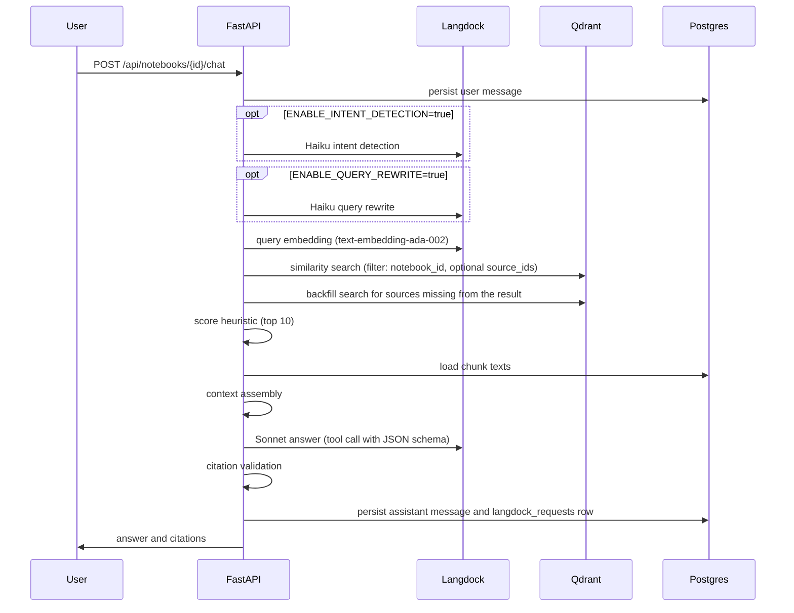

# RAG pipeline

Implemented in `apps/api/app/chat/service.py`, which orchestrates the modules
in `apps/api/app/rag/`.

## 1. Intent detection and query rewrite (optional)

`rag/query_understanding.py`. Both steps call Claude Haiku through
`LangdockClient` with the prompts `packages/prompts/haiku_intent_detection.md`
and `haiku_query_rewrite.md`. They are switched on with
`ENABLE_INTENT_DETECTION` and `ENABLE_QUERY_REWRITE` (both default to
`false`). If a step fails it is skipped: intent becomes `unknown`, the rewrite
falls back to the original question. The rest of the flow does not depend on
either.

When intent detection is on and the intent is `summary` or `briefing`, the
per-source cap of the score heuristic is lowered to one chunk, so that every
source gets a slot.

## 2. Query embedding

`LangdockClient.embed()` calls the OpenAI-compatible Langdock endpoint
(`text-embedding-ada-002`, 1536 dimensions). All search variants are embedded
in one batched call.

## 3. Similarity search

`rag/retrieval.py::search_notebook()` searches the collection
`notebook_chunks`, always filtered on `notebook_id` and optionally on the
`source_ids` the client sent. It returns up to 30 hits per search variant.
The synchronous Qdrant client runs in `asyncio.to_thread` so it does not block
the event loop.

## 4. Score heuristic and backfill

Hits from several search variants are merged per chunk, the highest score
wins. `backfill_missing_sources()` then covers a case that plain top-k search
misses: when one large source fills the whole top 30, the other sources never
appear as candidates. For every source of the notebook that has no candidate,
it runs one small extra Qdrant search (two hits). No Langdock call is involved.

`apply_score_heuristic()` selects the final 10 chunks. Instead of a plain
global top 10 it hands out slots round-robin over the sources (at most
`CONTEXT_MAX_CHUNKS_PER_SOURCE` per source, default 4), so that each source
contributes its best chunk first. Remaining slots go to the best remaining
chunks by score. Reranking with Haiku is not implemented.

## 5. Context assembly

`rag/context_assembly.py`. Qdrant stores only metadata, so the chunk texts are
loaded from Postgres and joined into one block per chunk with `source_id`,
`chunk_id`, document name, page and heading. Points without a matching
Postgres row are skipped.

## 6. Answer generation

The system prompt is `packages/prompts/system_final_answer.md`: answer only
from the given sources, do not invent facts or citations, say so when the
sources are insufficient. The prompts and UI strings of the application are
in German.

The model is called with a forced tool call whose input schema is
`packages/prompts/final_answer_tool_schema.json` (`answer`, `citations[]`,
`confidence`, `missing_information[]`, `follow_up_questions[]`).
`LangdockClient.tool_output()` returns the tool input as a Python dict, so no
free-text JSON parsing is needed. The same mechanism (`generate_structured`)
generates the studio artifacts.

The token budget is `CHAT_ANSWER_MAX_TOKENS` (default 4096). If the answer is
cut off (`stop_reason=max_tokens`), the call is repeated once with twice the
budget.

## 7. Citation validation

`rag/citation_validation.py::validate_citations()`. The model output is not
trusted; for each citation it checks:

- `chunk_id` is a valid UUID and exists in `chunks` for this notebook.
- The chunk's source exists and belongs to this notebook.
- A cited page number beyond the source's `page_count` is dropped and replaced
  by the chunk's own page.

Citations that fail are dropped, the answer is still returned. If no citation
survives, `downgrade_confidence_if_unsupported()` forces `confidence` to
`low`, so an unsupported answer is never shown as high confidence.

## 8. Response

The validated `ChatResponse` is stored as an assistant message and returned.
The frontend (`components/chat/CitationCard.tsx`) renders each citation with
document name, page and quote below the answer.

## Error handling

Each external step is guarded on its own. If embedding or retrieval fails, or
if the answer call fails (also after the truncation retry), the endpoint
returns a low-confidence response with an explanatory message instead of a
500, and the error is logged. If retrieval finds no chunks, the response says
that nothing relevant was found.
