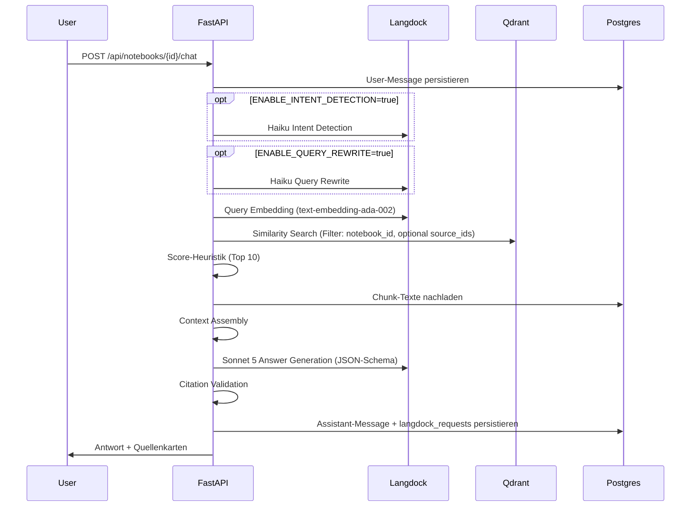

# RAG-Pipeline

## Überblick

Implementiert in `apps/api/app/chat/service.py`, orchestriert die Module in
`apps/api/app/rag/`.

## 1. Intent Detection & Query Rewrite (optional)

`apps/api/app/rag/query_understanding.py`. Beide Schritte nutzen Claude
Haiku über den `LangdockClient` und die Prompts
`packages/prompts/haiku_intent_detection.md` bzw.
`packages/prompts/haiku_query_rewrite.md`. Sie sind per
`ENABLE_INTENT_DETECTION` / `ENABLE_QUERY_REWRITE` (Default: `false`)
zuschaltbar - der Kernflow (Embedding → Retrieval → Sonnet → Citation
Validation) funktioniert unabhängig davon vollständig.

## 2. Query Embedding

`LangdockClient.embed()` (`apps/api/app/langdock/client.py`) ruft die
OpenAI-kompatible Langdock-Embedding-API auf (`text-embedding-ada-002`,
1536 Dimensionen). Bei jeder (ggf. umgeschriebenen) Suchvariante wird ein
Embedding erzeugt.

## 3. Similarity Search

`apps/api/app/rag/retrieval.py::search_notebook()` sucht in der
Qdrant-Collection `notebook_chunks`, gefiltert auf `notebook_id` (und
optional `source_ids`, falls der Client die Suche auf bestimmte Quellen
eingrenzen will). Liefert bis zu 30 Treffer pro Suchvariante.

## 4. Score-Heuristik

`apply_score_heuristic()` dedupliziert über mehrere Suchvarianten (höchster
Score gewinnt) und behält die Top 10 Chunks. Bewusst einfach für die MVP -
echtes Haiku-Reranking (`RERANKER_ENABLED`) ist als Erweiterungspunkt
vorgesehen, aber noch nicht implementiert.

## 5. Context Assembly

`apps/api/app/rag/context_assembly.py`. Qdrant speichert nur Metadaten im
Payload, nicht den vollen Chunk-Text - dieser wird aus Postgres (Source of
Truth) nachgeladen und zusammen mit `source_id`, `chunk_id`,
`document_name`, Seitenzahl und Heading zu einem strukturierten
Kontext-Block für Sonnet zusammengesetzt.

## 6. Answer Generation

System-Prompt: `packages/prompts/system_final_answer.md` (wortgetreu:
ausschließlich quellenbasiert antworten, keine erfundenen Fakten/Zitate,
Unklarheiten benennen). Output-Schema: `packages/prompts/output_schema.json`
(`answer`, `citations[]`, `confidence`, `missing_information[]`,
`follow_up_questions[]`). `LangdockClient.structured_output()` ruft Claude
Sonnet 5 auf und parst die Antwort als JSON.

## 7. Citation Validation

`apps/api/app/rag/citation_validation.py::validate_citations()`. Da dem
Modell nicht blind vertraut wird, prüft dieser Schritt für jede vom Modell
genannte Zitation:

- Existiert `chunk_id` überhaupt (gültige UUID, vorhanden in `chunks`)?
- Gehört der Chunk zum angefragten `notebook_id`?
- Gehört die zugehörige `source_id` ebenfalls zu diesem Notebook?
- Ist die genannte Seitenzahl plausibel (≤ `source.page_count`, sonst wird
  sie verworfen und durch die tatsächliche Chunk-Seite ersetzt)?

Nicht validierbare Zitate werden **verworfen statt die ganze Antwort zu
blockieren** (MVP-Robustheitsentscheidung). Bleiben nach der Validierung
keine Zitate übrig, wird `confidence` zwangsweise auf `low` herabgestuft
(`downgrade_confidence_if_unsupported()`), damit dem Nutzer nie eine
unbelegte Aussage als "high confidence" präsentiert wird.

## 8. Antwort + Quellenkarten

Die validierte `ChatResponse` (inkl. `citations[]`) wird als
Assistant-Message in Postgres persistiert und ans Frontend zurückgegeben.
`apps/frontend/components/chat/CitationCard.tsx` rendert je Zitat Dokumentname,
Seitenzahl und das wörtliche Zitat als eigene Karte unter der Antwort.

## Fehlerbehandlung

Jeder externe Aufruf (Embedding, Sonnet) ist einzeln abgesichert: schlägt
der Embedding-/Retrieval-Schritt fehl (z. B. ungültiger Langdock-Key), gibt
der Chat-Endpoint eine verständliche, niedrig-konfidente Antwort statt eines
500ers zurück; ebenso beim Sonnet-Aufruf. Der Fehler landet zusätzlich im
Server-Log.
